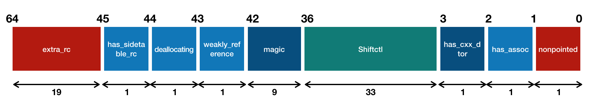

## Objective-C Runtime 解析（1） —— 从一个类开始


*以下源码均来自 [objc runtime 723](https://opensource.apple.com/tarballs/objc4/objc4-723.tar.gz)*

### 一个简单的例子

```objc
@interface TestObject : NSObject
@end
```

这里，我们构建了一个非常简单的 OC 类 —— 仅仅继承了 `NSObject`，没有任何的属性、方法等。


### NSObject

`TestObject` 这个类在 Runtime 中到底是如何表达的？我们先从 `NSObject` 看起：

```objc
@protocol NSObject
    
- (BOOL)isEqual:(id)object;
//...
- (id)performSelector:(SEL)aSelector;
//...
- (BOOL)isKindOfClass:(Class)aClass;
//...一大堆方法
@property (readonly, copy) NSString *description;
@end
    
@interface NSObject <NSObject> {
    /*
     这里的`OBJC_ISA_AVAILABILITY`比较有意思，在`objc-api.h`文件中找到了其定义，其中注释说道`isa`  
     会在未来废弃掉。看来苹果有过大改 Runtime 机制的想法，但最终放弃了。印象中因此才有了 Swift 的诞
     生
     */
    Class isa  OBJC_ISA_AVAILABILITY; 
}
//...一大堆方法
@end
```

可以看到，`NSObject` 类是一个遵循 `NSObject` 协议的大基类。`NSObject` 协议中包含了如 `isEqual:`, `isKindOfClass:` 和 `performSelector:` 等抽象方法。而 `NSObject` 类中包含了对 `NSObject` 协议方法的默认实现，以及如 `load`, `init` 和 `copy` 等 `NSObject` 类独有的方法。这些方法大多都是直接调用 Runtime 的私有 API 实现。例如经常用到的 `respondsToSelector:`方 法实现：

```objc
- (BOOL)respondsToSelector:(SEL)sel {
    if (!sel) return NO;
    return class_respondsToSelector_inst([self class], sel, self); //此方法暴露在`objc-private.h`头文件中
}
```

需要注意 `NSObject` 类中也有许多需要子类手动实现的抽象接口，例如：

```objc
// 子类需要重写`description`方法以返回正确的描述信息
- (NSString *)description {
    return nil;
}
```


### id

提到了 `NSObject` 则不得不提在 OC 中非常常见的 `id` 类型  —— `id` 的定义为一个指向 `objc_object` 的指针：

```objc
typedef struct objc_object *id;
```

`obj_object` 的定义大致如下：

```objc
struct objc_object {
private:
    isa_t isa;

public:
	//...一大堆方法
private:
    //...一大堆方法
```


### isa_t

可以看到 `objc_object` 中也有个 `isa` 指针，但与 `NSObject` 不同的是，这里的 `isa` 指针为 `isa_t` 类型。我们查看其源码发现，`isa_t` 为一个 `union` 联合体。(关于 `union` 的知识可以参考 [联合体（union）的使用方法及其本质](http://blog.csdn.net/huqinwei987/article/details/23597091))

```objc
union isa_t 
{
    isa_t() { }
    isa_t(uintptr_t value) : bits(value) { }

    Class cls;
    uintptr_t bits; // `uintptr_t`为unsigned long类型
}
```

除去上面的基础数据结构外，`isa_t` 在**不同架构下会有不同的附加数据结构**。例如在 arm64 环境下有 64 位的附加数据：

```objc
struct {
        uintptr_t nonpointer        : 1; // 是否开启指针优化，tagged pointer 相关
        uintptr_t has_assoc         : 1; // 是否有associated object
        uintptr_t has_cxx_dtor      : 1; // 是否有析构器
        uintptr_t shiftcls          : 33; // 类的指针，MACH_VM_MAX_ADDRESS 0x1000000000
        uintptr_t magic             : 6; // 固定为0xd2
        uintptr_t weakly_referenced : 1; // 对象是否有弱引用
        uintptr_t deallocating      : 1; // 对象是否正在析构
        uintptr_t has_sidetable_rc  : 1; // 对象的引用计数是否过大无法存储在isa中
        uintptr_t extra_rc          : 19; // 对象的（引用计数-1），必须为最高有效位
#       define RC_ONE   (1ULL<<45)
#       define RC_HALF  (1ULL<<18)
    };
```

这里用图片的方式更直观的描述下 `isa_t` 在 arm64 架构下内存中的存储：



这里非常有意思的是 Tagged Pointer，在 WWDC 2013 的 [Advances in Objective-C](https://developer.apple.com/videos/play/wwdc2013/404/) 中提到了 Runtime 中对于 Tagged Pointer 的应用。Tagged Pointer 主要应用于对指针内存的优化上。关于 Tagged Pointer 的问题，巧哥的一篇 [深入理解Tagged Pointer](http://www.infoq.com/cn/articles/deep-understanding-of-tagged-pointer) 作了深入解释。这里只简单介绍一下。

在内存存储中，指针的的地址是内存对齐，且与系统架构相关的。例如在 64 位的机器上，一个对象指针为 64 位。而指针中只有 60 位是真正的对象指针，剩余的四个低位主要为了内存对齐。

例如在 Objective-C 中，一个整数类型的 `NSNumber` 对象在 32 位系统中占用的内存大小为 4 个字节，但迁移到 64 为系统后，其所占的内存大小会翻倍，由 4 个字节变为 8 个字节。

苹果引入了 Tagged Pointed 技术后，对于一些如 `NSNumber`、`NSDate` 等长度不变且内存占用较小的对象，优化了其指针内存性能。通过对指针最低位设置为 `1` 来标明 Tagged Pointer，这时指针会被分成两部分 —— 保存数据的部分和附加标记的部分（例如引用计数等）。


### Class

在 `NSObject` 类的定义中，可以看到其只有 `Class` 类型一个公开的成员变量 `isa`。`Class` 的定义十分简单：一个指向 `objc_class` 结构体的指针：

```objc
typedef struct objc_class *Class;
```

相反，`objc_class `的定义非常的长，这里截取其重要部分：

```objc
struct objc_class : objc_object {
    // Class ISA;
    Class superclass;
    cache_t cache;             // formerly cache pointer and vtable
    class_data_bits_t bits;    // class_rw_t * plus custom rr/alloc flags
    
    class_rw_t *data() { 
        return bits.data();
    }
    //...一大堆方法
}
```

首先可以看到，`objc_class` 继承自 `objc_object`，因此，**在 Objective-C 中的类实际上也是一个对象**。那么，类的类是什么呢？这里便引入了 `Metaclass` 的概念。


### Metaclass

我们都知道 `object_getClass` 可以得到对象的类，具体方法为获取对象 `isa` 指针：

```objc
Class object_getClass(id obj)
{
    if (obj) return obj->getIsa();
    else return Nil;
}
```

那么如果类也是对象的话，`object_getClass` 是否也能得到类的类？

```Objc
Class classOfObj = object_getClass(obj);
Class classOfClass = object_getClass(classOfObj);
NSLog(@"class of obj: %@", classOfObj);
NSLog(@"class of class: %@", classOfClass);
```

输出如下：

```
class of obj: TestObject
class of class: TestObject
```

根据 `objc_class` 的源码，类的确有属于它的 `isa`，可是实际的输出结果来看——非常奇怪的是——类和元类（类的类）具有相同的名称（OC 中不允许存在两个重名的类）。

这里我们需要从 runtime 中创建类的函数 `objc_allocateClassPair` 来入手：

```objc
Class objc_allocateClassPair(Class superclass, const char *name, 
                             size_t extraBytes)
{
    Class cls, meta;

    rwlock_writer_t lock(runtimeLock);

    // Fail if the class name is in use.
    // Fail if the superclass isn't kosher.
    if (getClass(name)  ||  !verifySuperclass(superclass, true/*rootOK*/)) {
        return nil;
    }

    // Allocate new classes.
    cls  = alloc_class_for_subclass(superclass, extraBytes);
    meta = alloc_class_for_subclass(superclass, extraBytes);

    // fixme mangle the name if it looks swift-y?
    objc_initializeClassPair_internal(superclass, name, cls, meta);

    return cls;
}
```

可以看到 `objc_allocateClassPair` 函数的源码非常清晰易读。首先其内部声明了两个局部变量 `cls` 和 `meta` 来表示类和其元类；然后紧接着检查了类名是否重复和父类是否合法：

```objc
// Fail if the class name is in use.
// Fail if the superclass isn't kosher.
if (getClass(name)  ||  !verifySuperclass(superclass, true/*rootOK*/)) {
    return nil;
}
```

这里也验证了 OC 中不允许出现重名类的规则。验证通过后接着便对 `cls` 和 `meta` 进行了内存分配：

```objc
// Allocate new classes.
cls  = alloc_class_for_subclass(superclass, extraBytes);
meta = alloc_class_for_subclass(superclass, extraBytes);
```

这里使用了同样的函数对两个变量进行了内存分配，且传入的参数也完全相同，也就是说 `alloc_class_for_subclass` 函数内并不会对类和元类进行区分，那么到此为止，`cls` 和 `meta` 是完全一样的结构。因此，可以猜想到类和元类在外部看来是一体的，但在内部必定是以一种特殊的方式进行区分。继续来看内部初始化函数 `objc_initializeClassPair_internal`:

```objc
static void objc_initializeClassPair_internal(Class superclass, const char *name, Class cls, Class meta)
{
    class_ro_t *cls_ro_w, *meta_ro_w;
    ...
    cls->data()->ro = cls_ro_w;
    meta->data()->ro = meta_ro_w;
    ...
    cls_ro_w->flags = 0;
    meta_ro_w->flags = RO_META;
    ...
}
```

在函数内部，找到了对类和元类的区分定义 —— 定义在 `class_rw_t` 结构体内的 `flags` 变量。也就是说，runtime 中通过 `flags` 来标识了类和元类。为了验证这个推断，我们看一下 `isMetaClass` 函数的内部实现：

```c
bool isMetaClass() {
    return data()->ro->flags & RO_META;
}
```

关于 `Metaclass` 的作用，在 OC 中一个非常典型的例子就是调用实例方法和类方法。我们都知道由于 OC 的动态性，方法调用实际上是发送消息，那么对于这个例子：

```Objc
TestObject *obj = [TestObj new];
[obj instanceMethod];
[TestObject classMethod];
```

通过对 Metaclass 的理解，可以想到 `[obj instanceMethod]` 过程中会在 `TestObject` 类的方法列表中查找对应的方法实现，而 `[TestObject classMethod]` 则会在 `TestObject` 的元类中查找方法实现。

Metaclass 概念的设计与面向对象的设计相关。在 Smalltalk 语言中就已经有 Metaclass 的概念了。在[维基百科](https://en.wikipedia.org/wiki/Metaclass#In_Smalltalk-80)中，有关 Metaclass 有一段描述：

> 在 Smalltalk 中，所有东西都是对象。并且，Smalltalk 是基于类的语言，也就是说任何对象都有一个对应的类定义了每个对象的结构以及对象可以理解的消息。综上，在 Smalltalk 中类也是一个对象，因此类必须是另一个类的实例对象（Metaclass）。

### 总结

最后，在了解完 `isa`, `NSObject` 和 Class 的概念后，再来看这张经典的图片，相信会有新的感受。


